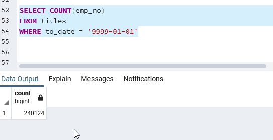
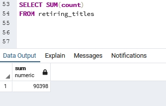
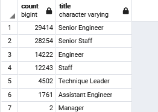
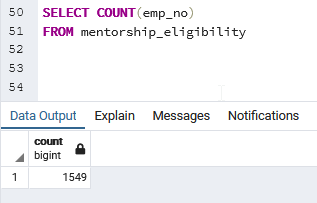
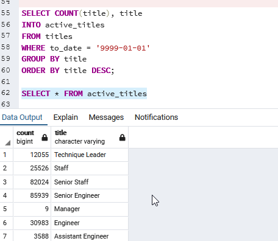
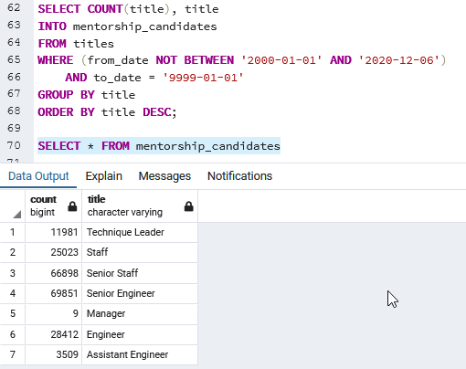
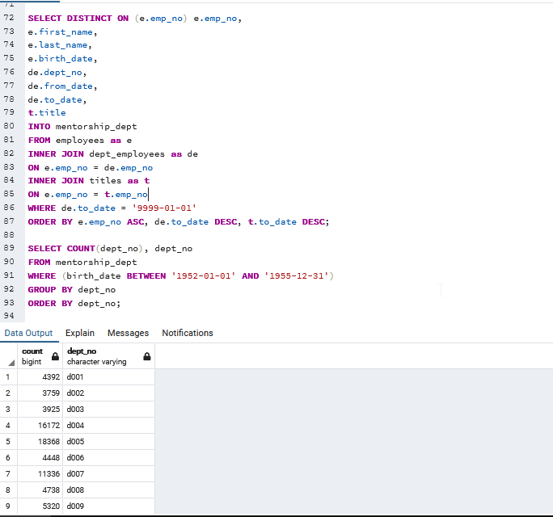
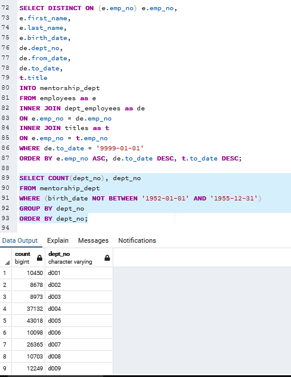

# Retiring Employees Analysis

## Overview of the analysis: 
The purpose of this analysis is to investigate our employee aging curves, specifically to find out which of our employees are nearing retirement. Through this analysis, we will get a better picture of how many of our employees are nearing retirement and also be able to plan succession programs for retiring employees e.g. mentorship programs.

## Results: 

Below are the results of our analysis on employees identified to be nearing retirement i.e. date of births between 1952 to 1955 (ages 65-68) and a hypothetical scenario where employees born in 1965 ( around age 55) are put into mentorship positions for better succession planning.

Retiring Employees:
- Based on our analysis of retiring employees born between 1952 to 1955, there are 90,398 employees in that range. This is compared with a total of 240,124 active employees, meaning 37% of our employees are close to retirement and highlights the seriousness of the issue at our company.

Screenshot of total active employees:

Screenshot of total retiring employees:

- The other observation is that we see most of our retiring employees occupy a senior position i.e. senior engineer, senior staff, technique leader and manager, where 68.8% (67,172 employees) of potential retirees are from a senior position. This highlights another issue where we will have to replace a talent drain at those positions which are usually harder to fill.

Screenshot of retiring employee by titles:

Mentorship Program:
-From our selection of employees born in 1965 (aged around 55), we see that there are 1,549 employees that are potentially capable of being mentors under this definition.

Screen shot of total employees eligible to be mentors: \

-We can also see that based on our earlier definition of "senior position", we see about 75.8% (1,175 employees) of candidates are able to mentor a senior position.

Screen shot of mentor candidates' breakdown:

## Summary: 

Based on our results above, we see that there is a significant amount of people that will need to be replaced, where the company is looking at 90,398 employees reaching retirement and of those, 67,172 employees occupy a senior position. This highlights a troubling issue where the company is not only losing about 37% of its workforce from retirement, but also a significant portion of senior positions which are much harder to fill.

For the purposes of this analysis, we will focus mainly on senior positions as the junior positions are in theory easier to fill as these are typically less experienced or technical positions. 

Screenshot of active titles:

At a quick glance, we can see based on our active roster has more people at those key senior positions compared to those retiring (~2-1.5 ratio between remaining employees {difference between active & retiring employees} and retiring employees). The assumption here is that all employees currently at senior positions should be able to mentor junior employees and elevate prospect candidates to vacancies regardless of age. If we impose certain eligibility requirements on our mentors e.g. experience over 20 years at the position, we see that there should still be sufficient coverage for the mentorship program (still about ~1-1.5 ratio between remaining employees and retiring employees).

Screenshot of eligible mentors over 20 years of experience:

Another consideration is whether we have sufficient coverage on a department basis i.e. whether the company is more exposed in certain departments than others. The below screenshots show that there is ~2-2.5 ratio of remaining employees and retiring employees, indicating that each department should be sufficiently covered.

Screenshot of retiring count of employees by department*:

Screenshot of retiring count of remaining employees by department:

*Note, active retiring employee count is different from above retiring employees by title due to some being already inactive.